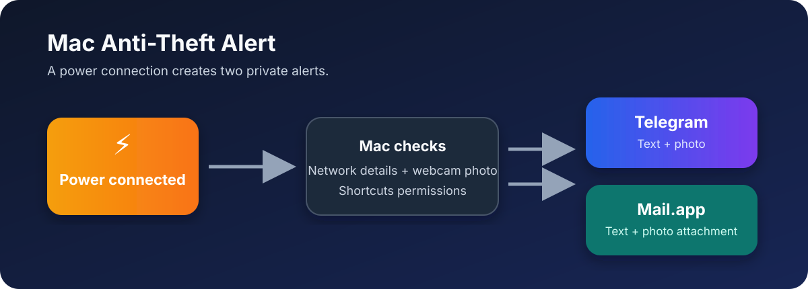
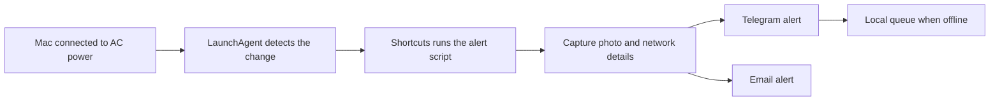

# Mac Anti-Theft Alert

**Get Telegram and email alerts when your locked Mac is plugged back into power.** This small macOS utility detects the battery-to-AC transition and can report the Mac name, time, Wi-Fi status, local and public IP addresses, an optional trusted-network label, and a webcam photo. SMTP photo attachments keep their capture timestamp in the filename. It was tested while the Mac was locked in an already-open user session.

It delivers each alert through two independent channels:

- **Telegram:** a dedicated bot sends the alert text and webcam photo to a private chat.
- **Email:** either Mail.app sends the same information and photo attachment, or direct SMTP sends it without requiring Mail.app to be configured.

If Telegram or direct SMTP is unavailable, the unsent parts of the alert are saved locally and retried automatically when the network returns. Mail.app hands delivery to its own outbox when the Mac is offline.



> [!IMPORTANT]
> This project sends an alert after a power connection is detected. It does not locate, lock, recover, or otherwise prevent theft of a Mac.

## Quick Start

1. Follow [installation](docs/INSTALL.md), then complete [setup](docs/SETUP.md).
2. Run the read-only diagnostic, then use the [test matrix](docs/USAGE.md) before relying on an automatic alert.
3. Read the [security review](docs/SECURITY-REVIEW.md) and [uninstall guide](docs/UNINSTALL.md) before enabling the project on a Mac you do not control.
4. Read [CONTRIBUTING.md](CONTRIBUTING.md) before opening an issue or proposing a change.

## What it does

- Watches the current power source once per minute through a user LaunchAgent.
- Detects a battery-to-AC transition.
- Runs a Shortcut, which has the macOS permissions to use the camera and Mail.app.
- Waits up to 30 seconds for the network, then collects network details and a photo with `imagesnap`. If the network is still unavailable, delivery is kept in the local queue for a later retry. A camera capture is stopped after 15 seconds so that an alert can still be delivered without a photo.
- Sends the text and photo to Telegram and either Mail.app or direct SMTP.
- Queues unsent Telegram and direct-SMTP parts securely under `~/.mac-alert/pending` if the Mac is offline, then removes queued items after the configured retention limit.

The queue is local to the Mac. It is intended to preserve the alert, not to bypass macOS permissions or account security.



## Requirements

- This configuration was developed and tested only on **macOS 27**. Other macOS versions may require adjustments, particularly for Shortcuts, privacy permissions, and LaunchAgents.
- macOS with Shortcuts. Mail.app is required only when `EMAIL_DELIVERY='mail_app'`; direct SMTP is available without Mail.app.
- [Homebrew](https://brew.sh/) and `imagesnap` for optional webcam photos.
- Python 3 for direct SMTP delivery. macOS 27 provided `/usr/bin/python3` during testing.
- A Telegram bot created through [@BotFather](https://t.me/BotFather).
- A private Telegram chat with that bot, after pressing **Start**.

### Install Homebrew and `imagesnap`

Homebrew is the package manager used here to install `imagesnap`, a small command-line utility that captures a still image from the built-in or connected webcam.

First, check whether Homebrew is already available:

```sh
brew --version
```

If the command is not found, install Homebrew with the installer published on the [official Homebrew website](https://brew.sh/):

```sh
/bin/bash -c "$(curl -fsSL https://raw.githubusercontent.com/Homebrew/install/HEAD/install.sh)"
```

Follow the installer prompts. On some Macs, it will show one additional command to add `brew` to your shell path; run that command before continuing. Confirm the installation with `brew --version`.

Then install `imagesnap`:

```sh
brew install imagesnap
```

Confirm that macOS can find it:

```sh
imagesnap -h
```

Run one local camera test before enabling the automation:

```sh
imagesnap ~/Desktop/imagesnap-test.jpg
```

macOS may ask for camera access. Allow it for the app that starts the command, then check that `imagesnap-test.jpg` was created on the Desktop. You can delete this test image afterwards.

## Set up Telegram

1. Create a dedicated bot with BotFather and store its token safely.
2. Open the bot conversation, press **Start**, and send it a unique phrase,
   such as `mac-alert-verify-blue-sparrow`.
3. Retrieve your chat ID locally using that same phrase:

   ```sh
   ~/.mac-alert/mac-alert-get-chat-id.sh 'mac-alert-verify-blue-sparrow'
   ```

   Use the returned ID of your **private chat**. Do not use the bot’s own
   numeric ID from BotFather or the `getMe` API: bots cannot send messages to
   themselves.

Do not paste a Telegram token into issues, screenshots, chat messages, or a repository. Revoke and replace it immediately if it is exposed.

## Install

Clone or download this repository, then from its folder run:

```sh
zsh install.sh
```

This creates `~/.mac-alert` with private permissions and copies `config.example` to `~/.mac-alert/config` when the file does not already exist.

Edit the configuration:

```sh
nano ~/.mac-alert/config
```

Fill in only your own values:

```sh
TELEGRAM_BOT_TOKEN='your-bot-token'
TELEGRAM_CHAT_ID='your-chat-id'
EMAIL_TO='you@example.com'

# Exact name of the Shortcut created below.
SHORTCUT_NAME='Mac Anti-Theft Alert'

# Optional: public IPs which should show as “At home”.
HOME_PUBLIC_IPS='203.0.113.10'

# Optional privacy controls.
CAPTURE_PHOTO='true'
LOOKUP_PUBLIC_IP='true'

# Offline queue retention.
QUEUE_MAX_AGE_DAYS='7'
QUEUE_MAX_ITEMS='50'
```

Save in Nano with `Ctrl+O`, press `Return`, then exit with `Ctrl+X`.

## Project files

| File | Purpose |
| --- | --- |
| `install.sh` | Installs all private files and both per-user LaunchAgents. |
| `config.example` | Documents the only supported local configuration values, including the Shortcut name. |
| `mac-alert-power-watch.sh` | Detects the battery-to-AC transition and applies the selected mode. |
| `mac-alert-lock-state-monitor.m` | Records whether the active user session is locked for locked-only mode. |
| `mac-alert.sh` | Collects alert data, takes the optional photo, sends Telegram and the selected email channel, and queues failed delivery offline. |
| `mac-alert-queue.sh` | Retries queued Telegram and direct-SMTP alerts and enforces retention limits. |
| `mac-alert-common.sh` | Safely reads the private configuration and sends Telegram requests without exposing the token in command arguments. |
| `mac-alert-mode.sh` | Selects Always, Locked only, or Off and loads/unloads the monitors. |
| `mac-alert-doctor.sh` | Read-only diagnostic for configuration, Shortcut, optional camera helper, and LaunchAgents. |
| `mac-alert-get-chat-id.sh` | One-time helper that matches a unique phrase to retrieve the intended private Telegram chat ID. |
| `mac-alert-select-chat-id.py` | Validates the Telegram update response and returns exactly one matching private chat ID. |
| `mac-alert-configure-gmail-smtp.sh` | Optional one-time helper for a personal Gmail SMTP setup. |
| `mac-alert-send-smtp.py` | Direct TLS/STARTTLS mail sender; reads an app password only from Keychain. |
| `uninstall.sh` | Removes project-controlled files and LaunchAgents; can also remove its SMTP Keychain item. |
| `tests/verify.sh` | Offline syntax, plist, compiler, and safe-configuration-parser verification. |

## Email delivery

The default `EMAIL_DELIVERY='mail_app'` uses the sending account already configured in Mail.app. It is the simplest option, but it depends on that account existing on the Mac.

Set `EMAIL_DELIVERY='smtp'` to deliver directly to an authenticated SMTP server instead. This mode does not open or control Mail.app. It supports `smtps://` servers, commonly on port 465, and `smtp://` servers that offer STARTTLS, commonly on port 587. The connection is always required to use TLS.

Add the provider-specific values to `~/.mac-alert/config`:

```sh
EMAIL_DELIVERY='smtp'
SMTP_URL='smtps://smtp.example.com:465'
SMTP_USER='you@example.com'
SMTP_FROM='you@example.com'
SMTP_KEYCHAIN_SERVICE='mac-alert.smtp'
```

Store the provider’s **app password** in the macOS login Keychain. Do not add it to `config`, Terminal history, screenshots, or the repository.

1. Open **Keychain Access** and select the **login** keychain.
2. Choose **File → New Password Item**.
3. Set **Keychain Item Name** to the value of `SMTP_KEYCHAIN_SERVICE`, for example `mac-alert.smtp`.
4. Set **Account Name** to the value of `SMTP_USER`, for example `you@example.com`.
5. Paste the provider’s app password into **Password**, then save.

The script reads that item only at send time. SMTP messages that cannot be delivered immediately stay in the same private retry queue as Telegram alerts and are retried automatically.

> [!NOTE]
> Obtain the SMTP host, port, encryption method, and app password from your email provider. Do not use your normal account password when the provider offers app passwords.

For a personal Gmail account whose app password has already been stored as `mac-alert.smtp` in the login Keychain, the helper fills these SMTP values automatically:

```sh
~/.mac-alert/mac-alert-configure-gmail-smtp.sh
```

## Choose the session mode

The alert supports three modes:

| Mode | Behaviour |
| --- | --- |
| **Always** | Sends an alert whether the already-open user session is unlocked or locked. This is the default and is useful while testing the feature. |
| **Locked only** | Sends an alert only while the already-open user session is showing the lock screen. |
| **Off** | Unloads both project LaunchAgents. It sends no alert and performs no queue retry until Always or Locked only is selected again. Existing queued alerts remain private on the Mac. |

Run the native mode selector:

```sh
~/.mac-alert/mac-alert-mode.sh
```

The choice is stored as `ALERT_MODE` in the local configuration file. Selecting **Off** unloads the project monitors; selecting either alert mode loads them again. The installer adds a small background monitor for the current user session. In locked-only mode it fails closed: no alert is sent until the monitor has observed a lock event. You can check the current screen state and mode without sending an alert:

```sh
~/.mac-alert/mac-alert-power-watch.sh --status
```

After installation, a restart, or returning from Off to **Locked only**, lock
and unlock the Mac once (`Control` + `Command` + `Q`, then sign in). The lock
monitor starts as `unknown` and this one cycle initializes it safely before the
first locked-screen power test.

### After restarting the Mac

There is no app to open. The two per-user LaunchAgents start automatically
after the user signs in to macOS, then the power watcher checks once per
minute.

- In **Always** mode, monitoring is ready after sign-in. Wait for one
  one-minute check before testing a battery-to-AC transition.
- In **Locked only** mode, lock and unlock the already-open session once after
  every restart before relying on an alert.
- In **Off** mode, neither monitor starts until the user chooses Always or
  Locked only again.

To inspect the local state without sending an alert, run:

```sh
~/.mac-alert/mac-alert-power-watch.sh --status
```

To confirm that the power watcher is loaded for the current user session, run:

```sh
launchctl print "gui/$(id -u)/com.example.mac-alert-power" | head
```

## Create the Shortcut

The LaunchAgent calls a Shortcut so that macOS can grant access to the camera and Mail.app.

1. Open **Shortcuts** and create a new shortcut named **Mac Anti-Theft Alert**, or choose another name and set the same value in `SHORTCUT_NAME`.
2. Add the **Run Shell Script** action.
3. Use `/bin/zsh` as the shell and enter:

   ```sh
   "$HOME/.mac-alert/mac-alert.sh"
   ```

4. In Shortcuts settings, enable **Allow Running Scripts** if macOS shows that option.
5. Run the shortcut once by hand. Approve the camera and Mail.app prompts when macOS asks.

Then enable the power watcher:

```sh
zsh install.sh --enable
```

## Test it

Run a local diagnostic without sending anything:

```sh
~/.mac-alert/mac-alert.sh --dry-run
```

Run the Shortcut manually to send a full test. Confirm that Telegram receives a text alert and a photo, and that the selected email channel delivers the same details and timestamped photo attachment.

Before the full test, run the local diagnostic. It sends no alert, does not
open the camera, and does not access the Keychain password:

```sh
~/.mac-alert/mac-alert-doctor.sh
```

For a power test, unplug the Mac, wait for the next one-minute poll, and plug it back in. The watcher triggers only when it observes the transition from battery to AC. It deliberately does not alert immediately after installation or login.

Test the intended locked-screen case as well: lock the Mac, connect power, then verify the alert after signing back in. Results may vary while the Mac is in deep sleep because user processes and network access can be suspended.

## Limitations

- **After a restart:** this project uses a per-user LaunchAgent. It cannot send an alert before that user has signed in after a restart. The initial macOS login screen is not an active user session.
- **While asleep:** scripts do not run during sleep. If the Mac is connected to power while asleep, the transition can be detected only after the Mac wakes and the watcher runs again. Delivery then also depends on the network returning.
- **Locked screen:** it is designed for a Mac locked within an already-open user session. This is different from the first login screen shown immediately after restarting the Mac.
- **Deep sleep and power loss:** prolonged sleep, a completely drained battery, shutdown, or loss of network may prevent an immediate alert. Telegram and direct-SMTP parts created while offline are kept in the local queue and retried after connectivity returns.

## Offline behaviour

If Telegram cannot be reached after 30 seconds, the script saves the text and, if available, photo in `~/.mac-alert/pending` using private permissions. The LaunchAgent retries queued Telegram items once per minute and deletes an item only after all of its parts have been sent.

Direct SMTP alerts use the same private queue. Mail.app uses its own outbox when that delivery mode is selected.

## Security and privacy

- Keep `~/.mac-alert/config` at mode `600`; it contains the bot token.
- Do not commit the completed config file. The repository contains only `config.example`.
- Telegram and the configured email provider receive the selected alert content. Telegram is contacted directly; public-IP lookup, when enabled, uses `api.ipify.org`.
- Webcam photos and queued data remain locally protected until sent. Set `CAPTURE_PHOTO='false'` to send no photo.
- Set `LOOKUP_PUBLIC_IP='false'` to avoid the public-IP lookup and omit that address from alerts.
- The offline queue has a default maximum age of seven days and a default maximum of 50 alerts. Adjust `QUEUE_MAX_AGE_DAYS` and `QUEUE_MAX_ITEMS` if needed.
- `HOME_PUBLIC_IPS` only labels known public IP addresses. This project does not call an external geolocation service.
- Treat Telegram bot access and the email delivery account as sensitive. Use [uninstall](docs/UNINSTALL.md) and revoke the bot token if the Mac is transferred to someone else.

## Troubleshooting

| Symptom | What to check |
| --- | --- |
| No photo | Run the Shortcut manually and approve camera access for Shortcuts and `imagesnap`. |
| Telegram message arrives without a photo | Check `imagesnap` is installed and allowed to access the camera. |
| Wi-Fi shows “SSID unavailable” | macOS can hide the SSID from background processes. A local IP still indicates connectivity. |
| No automatic power alert | Ensure the Shortcut name matches exactly, then run `launchctl print gui/$(id -u)/com.example.mac-alert-power`. |
| Alert waits for network | Inspect `~/.mac-alert/pending`; it will retry automatically once the relevant delivery service is reachable. |
| Direct SMTP fails | Confirm the Keychain account/service names match `SMTP_USER` and `SMTP_KEYCHAIN_SERVICE`; test the provider's SMTP host and app password. |

## Uninstall

See [docs/UNINSTALL.md](docs/UNINSTALL.md) for removal of the project files,
LaunchAgents, queue, local credentials, Shortcut, and optional dependencies.

## License

Released under the [MIT License](LICENSE).

## Project maintenance

Use [CONTRIBUTING.md](CONTRIBUTING.md) for bug reports and changes, and
[docs/RELEASE.md](docs/RELEASE.md) before publishing a GitHub release.
